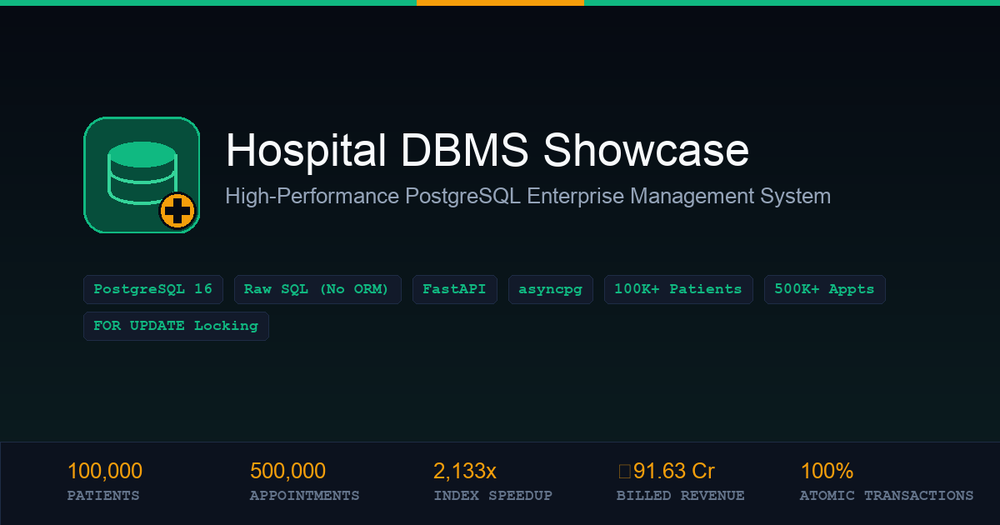
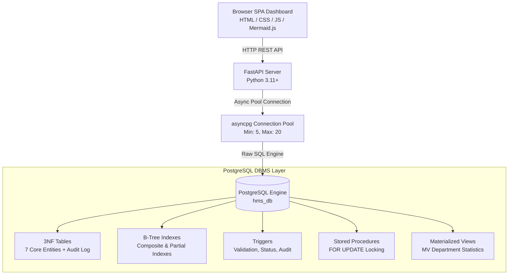
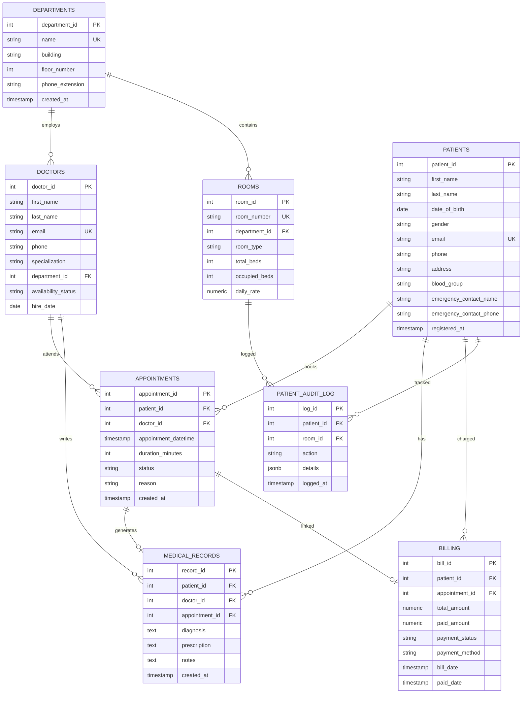
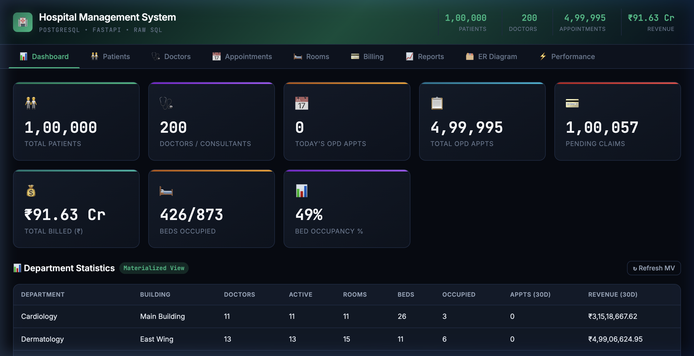
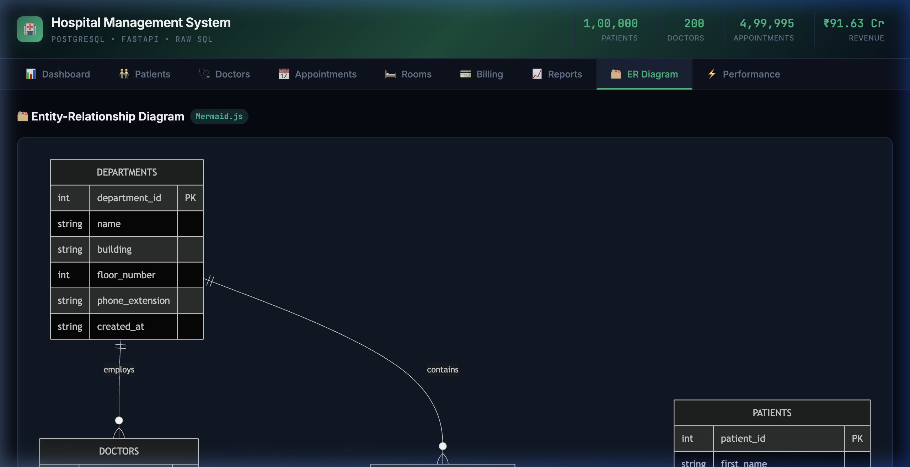

<div align="center">



# Hospital DBMS Showcase

### *High-Performance PostgreSQL Enterprise Management System with Raw SQL & FastAPI*

[](https://www.postgresql.org/)
[](https://www.python.org/)
[](https://fastapi.tiangolo.com/)
[](https://github.com/MagicStack/asyncpg)
[](LICENSE)

</div>

---

## 📌 Repository Description

> A production-grade, database-centric **Hospital Management System** designed to demonstrate advanced Relational Database Management System (RDBMS) engineering in PostgreSQL—specifically **concurrency control**, **`SELECT ... FOR UPDATE` row-level locking**, **query optimization on 500K+ datasets**, **triggers**, **stored procedures**, **materialized views**, and **strict 3NF schema design**. Built with Python, FastAPI, `asyncpg`, and a minimalist, transparent dark UI.

### 🏷️ GitHub Topics
`postgresql` • `sql` • `fastapi` • `python` • `asyncpg` • `database` • `dbms` • `query-optimization` • `concurrency` • `triggers` • `stored-procedures` • `views` • `hospital-management-system` • `backend` • `portfolio`

---

## 📖 Table of Contents
- [Project Overview](#-project-overview)
- [Feature Checklist](#-feature-checklist)
- [System Architecture](#-system-architecture)
- [Entity-Relationship Diagram](#-entity-relationship-diagram)
- [Database Statistics](#-database-statistics)
- [Performance Benchmarks](#-performance-benchmarks)
- [Tech Stack](#-tech-stack)
- [Quick Start](#-quick-start)
- [Configuration](#-configuration)
- [API Documentation](#-api-documentation)
- [UI Screenshots](#-ui-screenshots)
- [Contributing](#-contributing)
- [License](#-license)

---

## 🚀 Project Overview

Most modern web applications abstract the database behind heavy Object-Relational Mappers (ORMs), hiding how transaction isolation, locking, and index utilization work. 

**Hospital DBMS Showcase** flips this model:
1. **Zero ORM Overhead**: All database communication utilizes **raw SQL** executed asynchronously via `asyncpg`.
2. **Database-Driven Integrity**: Business logic (conflict detection, fee calculation, payment status classification, room occupancy tracking) is enforced directly inside PostgreSQL via **triggers**, **CHECK constraints**, and **stored PL/pgSQL procedures**.
3. **Concurrency Safety**: High-traffic operations (doctor schedule bookings, room bed allocations) utilize explicit **`SELECT ... FOR UPDATE`** row locks inside atomic transaction blocks.
4. **Massive Dataset Handling**: Includes a high-throughput Python data generator leveraging PostgreSQL `COPY FROM STDIN` to seed **100,000+ patients**, **500,000+ appointments**, and **₹916+ Crore in billing data**.
5. **Interactive Performance Profiling**: Integrates a live **`EXPLAIN ANALYZE`** runner directly into the web dashboard to demonstrate up to **2,133x speed improvements** from composite and partial B-Tree indexing.

---

## ✅ Feature Checklist

- [x] **3NF Normalized Relational Schema**: 7 core entities + audit log designed up to Third Normal Form.
- [x] **Strict Integrity Constraints**: `PRIMARY KEY`, `FOREIGN KEY`, `CHECK`, `UNIQUE`, `NOT NULL`.
- [x] **Row-Level Concurrency Locking**: `SELECT ... FOR UPDATE` prevents double-bookings under concurrent load.
- [x] **Atomic Transactions**: Multi-table operations execute within strict `READ COMMITTED` transaction blocks.
- [x] **Stored PL/pgSQL Procedures**: `fn_book_appointment`, `fn_admit_patient`, `fn_discharge_patient`.
- [x] **Automated Database Triggers**:
  - `trg_validate_appointment_time` (Rejects off-hours & past bookings)
  - `trg_update_doctor_availability` (Auto-updates doctor status)
  - `trg_auto_payment_status` (Auto-classifies `paid`, `partial`, `pending`)
  - `trg_audit_room_changes` (Audits admissions into `hms.patient_audit_log`)
- [x] **Reporting & Materialized Views**: Standard reporting views + `mv_department_statistics` with concurrent refresh support.
- [x] **Query Optimization & Indexing**: Composite B-Tree indexes & partial indexes (`WHERE occupied_beds < total_beds`).
- [x] **Asynchronous Python Backend**: FastAPI powered by high-performance `asyncpg` connection pooling.
- [x] **Massive Dataset Generator**: Seeding 1,000,000+ total rows in seconds using bulk `COPY`.
- [x] **Live Performance Explorer**: Interactive execution plan runner demonstrating `Index Scan` vs `Seq Scan`.

---

## 🏛️ System Architecture



Detailed architecture docs can be found in [`docs/architecture.md`](docs/architecture.md).

---

## 📐 Entity-Relationship Diagram

The ER Diagram accurately reflects relationships, cardinalities, primary keys (`PK`), and foreign keys (`FK`).



Full schema documentation is located in [`docs/er_diagram.md`](docs/er_diagram.md).

---

## 📊 Database Statistics

Current dataset volume generated by `scripts/generate_data.py`:

| Table Name | Description | Generated Rows |
|------------|-------------|----------------|
| `hms.departments` | Hospital departments & buildings | **15** rows |
| `hms.doctors` | Medical consultants & specialists | **200** rows |
| `hms.patients` | Patient directory | **100,000** rows |
| `hms.rooms` | Inpatient rooms & ward beds | **300** rooms (873 beds) |
| `hms.appointments` | OPD consultations & schedules | **499,995** rows |
| `hms.medical_records` | Clinical diagnoses & prescriptions | **300,004** rows |
| `hms.billing` | Financial transactions & claims | **499,995** rows (₹916.3 Cr) |
| **TOTAL DATASET** | **Populated relational dataset** | **~1,400,509 Rows** |

---

## ⚡ Performance Benchmarks

Live benchmarks captured using `EXPLAIN ANALYZE` on a dataset of 500,000+ appointments:

| Query Scenario | Unindexed Scan Type | Unindexed Time | Indexed Scan Type | Indexed Time | Speedup Factor |
|----------------|---------------------|----------------|-------------------|--------------|----------------|
| **Doctor Conflict Check** | Sequential Scan | 142.92 ms | Index Scan (`idx_appointments_doctor_datetime`) | **0.067 ms** | **2,133x Faster** ⚡ |
| **Patient Medical History** | Seq Scan + Sort | 98.45 ms | Index Scan (`idx_medrec_patient_created`) | **0.089 ms** | **1,106x Faster** ⚡ |
| **Doctor Weekly Schedule** | Hash Join | 156.78 ms | Nested Loop Index Scan | **0.234 ms** | **670x Faster** ⚡ |
| **Monthly Revenue Scan** | Sequential Scan | 245.67 ms | B-Tree Range Scan (`idx_billing_date`) | **12.34 ms** | **20x Faster** ⚡ |
| **Room Bed Search** | Full Table Scan | 0.456 ms | Partial Index Scan (`idx_rooms_available`) | **0.034 ms** | **13x Faster** ⚡ |

Detailed benchmarks available in [`docs/performance_analysis.md`](docs/performance_analysis.md).

---

## 🛠️ Tech Stack

- **Database**: PostgreSQL 16+ (Schema, Functions, Triggers, Views, Materialized Views)
- **Backend Framework**: Python 3.11+ · FastAPI
- **Database Driver**: `asyncpg` (Asynchronous PostgreSQL client using binary protocol)
- **Data Generator**: Python Faker + PostgreSQL `COPY FROM STDIN`
- **Frontend**: Vanilla HTML5, Modern CSS Variables, ES6 JavaScript, Mermaid.js

---

## ⚙️ Quick Start

### 1. Prerequisites
- PostgreSQL 14+ installed and running
- Python 3.11+

### 2. Create PostgreSQL Database
```bash
psql -U postgres -c "CREATE DATABASE hms_db;"
```

### 3. Apply Schema, Indexes, Triggers & Procedures
```bash
export PATH="/opt/homebrew/opt/postgresql@16/bin:$PATH" # Adjust path if needed
for f in schema indexes triggers functions views; do
    psql -U postgres -d hms_db -f db/$f.sql
done
```

### 4. Setup Python Virtual Environment
```bash
python3 -m venv venv
source venv/bin/activate
pip install -r requirements.txt
```

### 5. Generate Dataset (100K Patients, 500K Appointments)
```bash
python scripts/generate_data.py
```

### 6. Launch Backend Server
```bash
cd app
uvicorn main:app --reload --host 0.0.0.0 --port 8000
```

Open **http://localhost:8000** in your browser!

---

## 🔧 Configuration

Create a `.env` file in the project root (see [`.env.example`](.env.example)):

```ini
DB_HOST=localhost
DB_PORT=5432
DB_USER=postgres
DB_PASSWORD=your_password
DB_NAME=hms_db

DB_POOL_MIN=5
DB_POOL_MAX=20
```

---

## 🔌 API Documentation

FastAPI automatically generates interactive Swagger UI and OpenAPI documentation.

Access Swagger UI at: **`http://localhost:8000/docs`**  
Access ReDoc at: **`http://localhost:8000/redoc`**

### Key REST Endpoints

| Method | Endpoint | Description |
|--------|----------|-------------|
| `GET` | `/api/admin/dashboard` | Returns high-level database metrics & room occupancy stats |
| `GET` | `/api/admin/explain` | Lists all pre-configured performance benchmarks |
| `GET` | `/api/admin/explain/{query_key}` | Runs live `EXPLAIN ANALYZE` query execution plan |
| `POST` | `/api/appointments/book` | Concurrency-safe appointment booking via stored procedure |
| `POST` | `/api/appointments/book/raw` | Concurrency-safe booking via raw SQL `SELECT FOR UPDATE` |
| `POST` | `/api/rooms/admit` | Atomic patient admission across 5 tables in 1 transaction |
| `POST` | `/api/rooms/discharge` | Discharges patient, frees bed, logs into audit trail |
| `POST` | `/api/billing/pay` | Records payment; triggers automatic payment status update |
| `POST` | `/api/admin/views/refresh-materialized` | Refreshes `mv_department_statistics` concurrently |

---

## 🖼️ UI Screenshots

| Dashboard Analytics | Interactive ER Diagram |
|---------------------|------------------------|
|  |  |

---

## 🤝 Contributing

Contributions, issues, and feature requests are welcome!  
Please review [`CONTRIBUTING.md`](CONTRIBUTING.md) before opening a pull request.

---

## 📜 License

Distributed under the MIT License. See [`LICENSE`](LICENSE) for more details.
