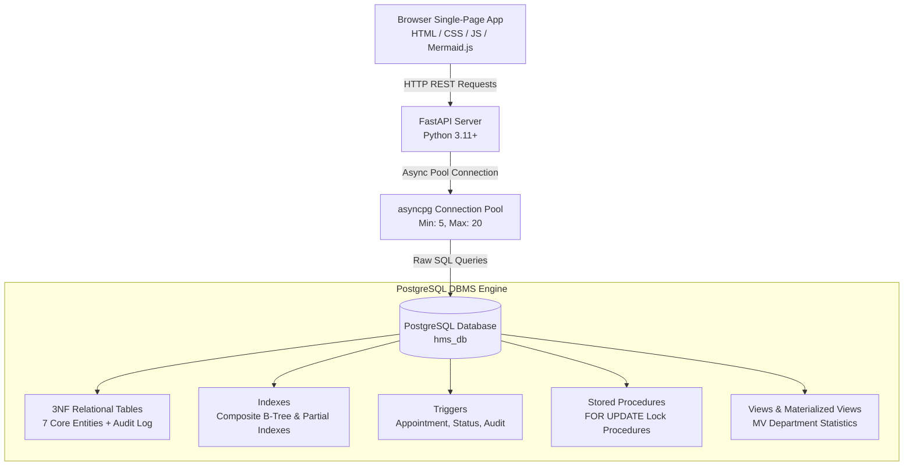

# System Architecture — Hospital DBMS Showcase

This document details the multi-tier database-centric architecture of the **Hospital DBMS Showcase**.

---

## 🏛️ Architecture Flow

---

## 🔒 Concurrency & Transaction Control Architecture

1. **Row-Level Locking (`SELECT FOR UPDATE`)**:
   - Doctor schedule slot conflicts are locked at row-level inside atomic transaction blocks.
   - Bed allocation locks `hms.rooms` row before updating `occupied_beds` count.

2. **Atomic Multi-Table Transactions**:
   - `fn_admit_patient` executes room lock, bed counter increment, appointment creation, medical record initialization, and billing record creation in a single transaction block.

3. **Materialized View Concurrent Refreshes**:
   - `mv_department_statistics` supports `REFRESH MATERIALIZED VIEW CONCURRENTLY` to provide instantaneous analytical reads without blocking write transactions.
