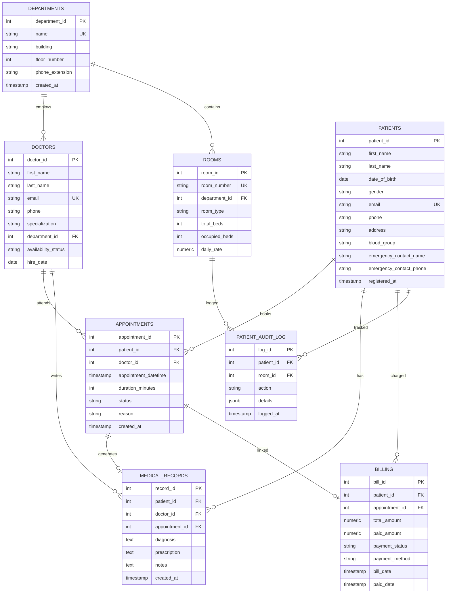

# Entity-Relationship Diagram — Hospital DBMS Showcase

This document provides the complete normalized relational schema (up to 3NF) for the **Hospital DBMS Showcase** application.

---

## 📐 ER Diagram (Mermaid.js)

---

## 🔑 Entity Integrity & Constraints Summary

| Entity | Primary Key | Foreign Keys | Unique Constraints | Check Constraints |
|--------|------------|--------------|-------------------|-------------------|
| **DEPARTMENTS** | `department_id` | — | `name` | `floor_number >= 0` |
| **DOCTORS** | `doctor_id` | `department_id` | `email` | `availability_status IN ('active','on_leave','unavailable')` |
| **PATIENTS** | `patient_id` | — | `email` | `gender IN ('M','F','O')`, `blood_group` valid blood type |
| **ROOMS** | `room_id` | `department_id` | `room_number` | `total_beds > 0`, `occupied_beds >= 0 AND <= total_beds`, `daily_rate > 0` |
| **APPOINTMENTS** | `appointment_id` | `patient_id`, `doctor_id` | `(doctor_id, appointment_datetime)` | `status IN ('scheduled','completed','cancelled','no_show')`, `duration_minutes > 0` |
| **MEDICAL_RECORDS** | `record_id` | `patient_id`, `doctor_id`, `appointment_id` | — | — |
| **BILLING** | `bill_id` | `patient_id`, `appointment_id` | — | `total_amount >= 0`, `paid_amount >= 0 AND <= total_amount` |
| **PATIENT_AUDIT_LOG** | `log_id` | `patient_id`, `room_id` | — | — |
